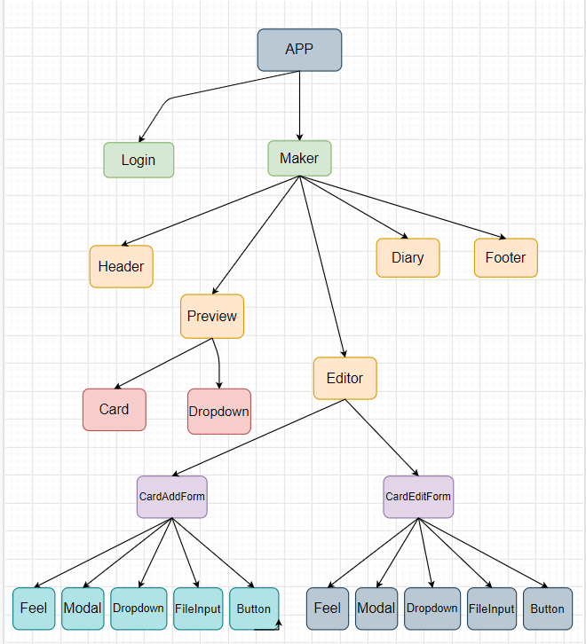
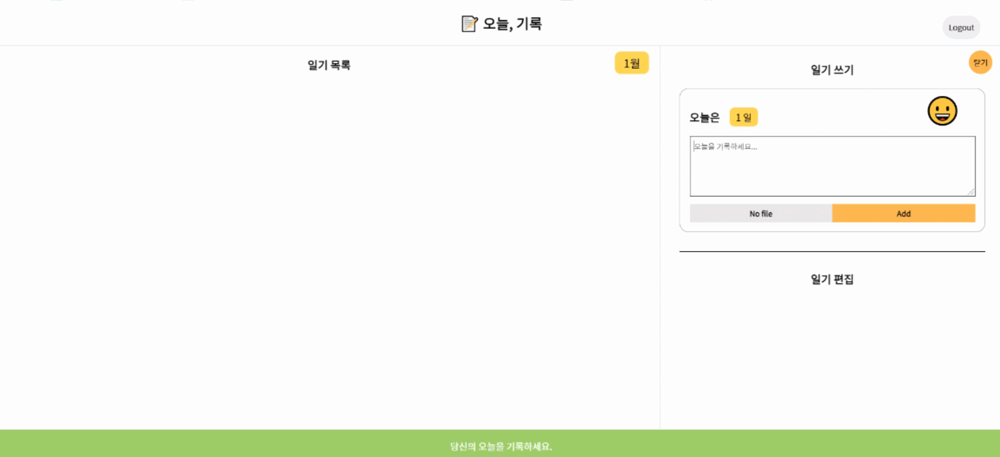
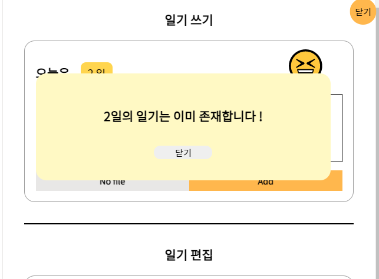
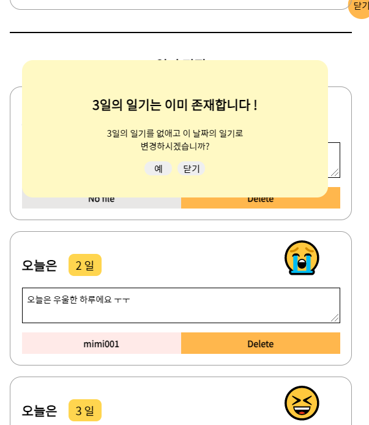
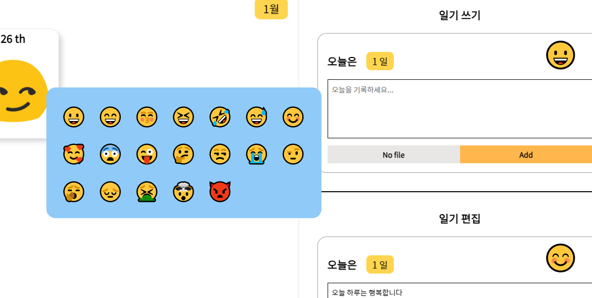
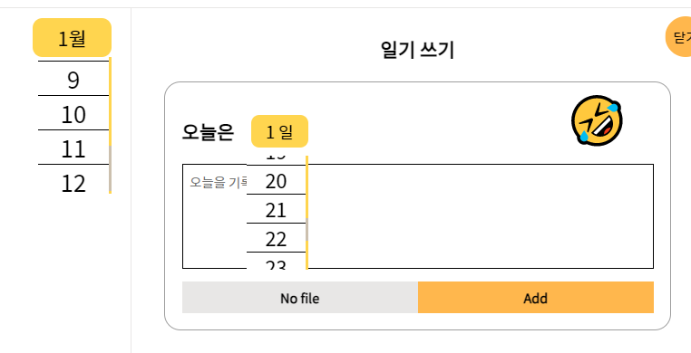
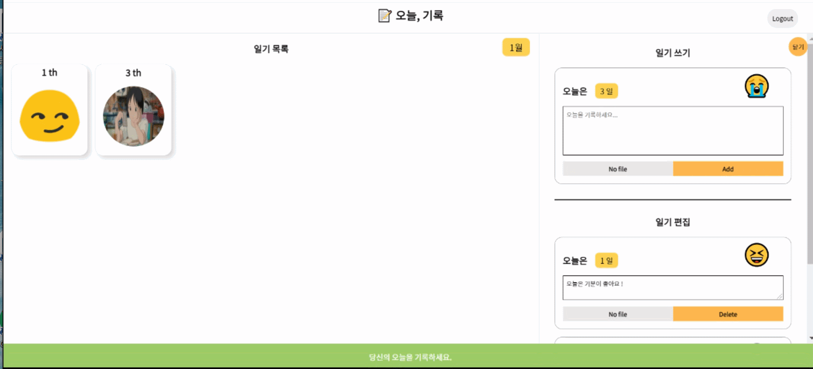
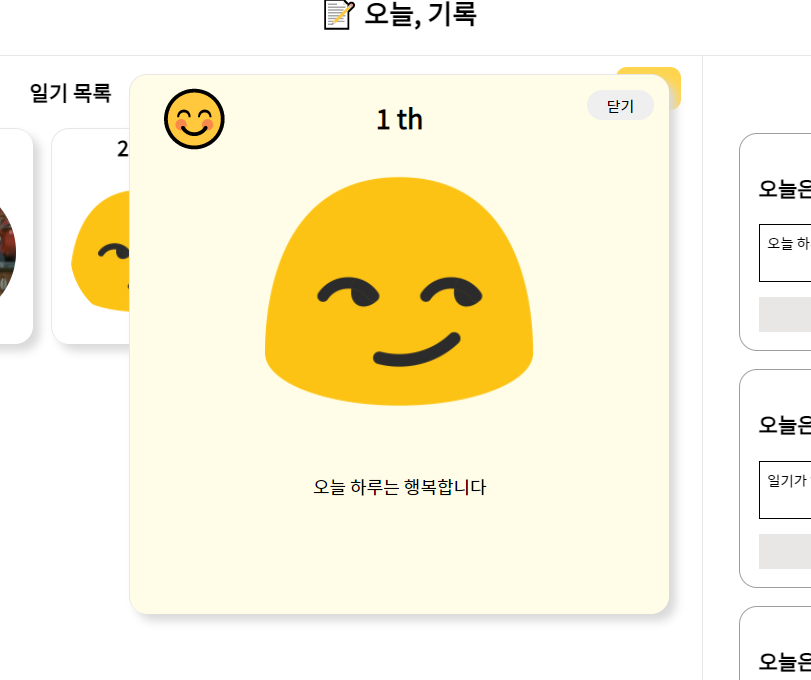

# Diary maker - Girok

<br>

> 오늘하루를 기록하는 일기 웹 어플리케이션

<br>

### 데모링크 [https://songchangyeop.github.io/Diary--Today-Girok/#/Diary--Today-Girok/](https://songchangyeop.github.io/Diary--Today-Girok/#/Diary--Today-Girok/)

<br>
<br>

---

## Overview

[1. Stack](#stack)
<br>

[2. 컴포넌트 구조](#컴포넌트-구조)
<br>

[3. 기능](#기능)
<br>

[3-1. 일기추가](#일기추가)<br>
[일기의 중복생성 경고](#일기의-중복생성-경고)
<br>

[3-2. 일기편집](#일기편집)<br>
[수정을 원하는 날짜의 일기가 이미 존재할 경우 경고](#수정을-원하는-날짜의-일기가-이미-존재할-경우-경고)
<br>

[3-3. 오늘의 Emotion 선택](#오늘의-emotion-선택)
<br>

[3-4. Dropdown](#dropdown)
<br>

[3-5. Cloudinary](#Cloudinary)
<br>

[3-6. Firebase](#firebase)
<br>

[3-7. 일기 보기](#일기-보기)
<br>

[4. 앞으로의 개선사항](#앞으로의-개선사항)
<br>

[5. 개발하면서 했던 고민](#개발하면서-했던-고민)
<br>
<br>
<br>

# 1. Stack

<br>

```
React, React-router-dom, Firebase, Cloudinary
```

<br>
<br>
<br>

# 2. 📁 컴포넌트 구조

<p align="center"></p>

<br>
<br>

# 3. 🔨 기능

<br>

## 3 - 1 📝 일기추가

<br>

<p align="center"></p>

<br>
<br>

```js
const createCard = (card) => {
  setCards((cards) => {
    // 현재 일기리스트 객체를 가지고있는 State 수정
    const updated = { ...cards };
    updated[card.id] = card;
    return updated;
  });
  cardRepository.saveCard(userId, card, month); // Firebase의 Database에 접근하는 클래스 내부의 saveCard 함수 호출
};
```

<br>

Maker 컴포넌트에서 일기를 생성하는 함수를 일기를 추가하는 Form 컴포넌트에 props로 전달하게됩니다

<br>

```js
const card = {
  //  일기객체 생성
  id: today, //uuid
  emotion: currentEmotion,
  date: currentDay,
  message: messageRef.current.value || '일기가 없습니다!',
  fileName: file.fileName || '',
  fileURL: file.fileURL || '',
  beforeId: today,
};
formRef.current.reset();
setFile({
  // 사진을 저장하기 위한 State
  fileName: file.name,
  fileURL: file.url,
});
onAdd(card); // createCard 함수
```

일기를 추가하는 컴포넌트인 AddForm에 일기가 Submit 될 때 마다 card 객체를 생성하여 Maker 컴포넌트의 createCard 함수에 매개변수로 넘겨줍니다

<br>

### ❗ 일기의 중복생성 경고

<br>

<p align="center"></p>

```js
const cardsToArr = Object.entries(cards);
for (let i = 0; i < cardsToArr.length; i++) {
  //2차원 배열의 접근을 위한 for loop
  if (cardsToArr[i][1].date === currentDay) {
    setOpenModal(true); // date가 같은 일기가 card 배열에 존재할 경우 Modal Open
    return;
  }
}
```

일기를 생성할 때 생성하고싶은 날짜의 일기가 이미 존재한다면 경고 모달을 보여줍니다

<br>

---

<br>

## 3 - 2 📝 일기편집

<br>

```js
const updateCard = (card) => {
  setCards((cards) => {
    const updated = { ...cards };
    delete updated[card.beforeId];
    return updated;
  });
  cardRepository.removeCard(userId, card, month, 'update'); // Firebase의 Database에 접근하는 클래스 내부의 removeCard 함수 호출
  setCards((cards) => {
    const updated = { ...cards };
    updated[card.id] = card;
    return updated;
  });
  cardRepository.saveCard(userId, card, month); // Firebase의 Database에 접근하는 클래스 내부의 saveCard 함수 호출
};

const createCard = (card) => {
  setCards((cards) => {
    const updated = { ...cards };
    updated[card.id] = card;
    return updated;
  });
  cardRepository.saveCard(userId, card, month); // Firebase의 Database에 접근하는 클래스 내부의 saveCard 함수 호출
};
```

updateCard( ) : Maker 컴포넌트에서 일기의 날짜가 Update 되면 기존의 일기를 Delete하고 새롭게 업데이트된 일기를 추가합니다

<br>

createCard( ) : Maker 컴포넌트에서 일기의 Text가 Update 되면 업데이트된 일기를 추가합니다 <br>

<br>

```js
const onChange = (event, date, newId, beforeId) => {
  if (event.target.value === null) {
    console.log(event.target);
    return;
  }

  event.preventDefault();
  let value = event.target.value;
  let currentId = `${year}${month}${value}`;
  date
    ? updateDay({
        // Maker 컴포넌트의 updateCard함수
        ...card,
        [date]: value,
        [newId]: currentId,
        [beforeId]: card.id,
      })
    : updateCard({
        //  Maker 컴포넌트의 createCard함수
        ...card,
        [event.target.name]: value,
      });
};
```

일기를 편집하는 컴포넌트인 EditForm에 일기가 Update 될 때 마다 onChange 함수를 실행하여 날짜가 업데이트 된 경우에는 UpdateDay 함수를 호출하고 Text를 업데이트한 경우에는 updateCard 함수를 호출합니다

<br>

### ❗ 수정을 원하는 날짜의 일기가 이미 존재할 경우 경고

<br>

<p align="center"></p>

<br>

```js
const showModal = (event, date, newId, beforeId) => {
  setCurrentEvent(event);
  let value = event.target.value;
  let currentId = `${year}${month}${value}`;
  const cardsToArr = Object.entries(cards);

  for (let i = 0; i < cardsToArr.length; i++) {
    // 2차원 배열의 접근을 위한 for loop
    if (cardsToArr[i][1].id === currentId) {
      setSelectDay(value);
      setOpenModal(true);
      return;
    }
  }
  onChange(event, date, newId, beforeId);
};
```

Dropdown에서 선택 된 날짜를 for loop 를 이용해 같은 Id의 일기가 존재하면 경고 Modal을 보여주고 존재하지 않으면 바로 onChange 함수가 호출 되도록 합니다.

<br>

```js
const Modal = ({
  showAddFormModal,
  showEditFormModal,
  currentDay,
  allowUpdate,  // '예' 버튼을 클릭하면 update가 되는 allowUpdate 함수
}) => {

  <button className={styles.close} type="button" onClick={allowUpdate}>
    예
  </button>
```

Modal 컴포넌트에서 '예' 버튼을 클릭하면 props로 받아온 allowUpdate 함수를 실행합니다

<br>

```js
const allowUpdate = () => {
  onChange(currentEvent, 'date', 'id', 'beforeId');
  setOpenModal(false);
};
```

allowUpdate 함수가 실행되면 onChange 함수를 호출하여 일기를 수정하고, OpenModal을 false로 바꾸어 Modal이 보이지 않도록 합니다

---

<br>

## 3 - 3 😄 오늘의 Emotion 선택

<p align="center"></p>

<br>

오늘의 감정을 이모지를 선택하여 나타낼 수 있습니다
<br>

```js
const Feel = ({ changeEmotion, showFeelComponent }) => {
  const [emotions] = useState([
    '😀',
    '😄',
    '😚',
    '😆',
    '🤣',
    '😅',
    '😊',
    '🥰',
    '😨',
    '😜',
    '🤔',
    '😒',
    '😭',
    '🤨',
    '🥱',
    '😔',
    '🤮',
    '🤯',
    '👿',
  ]);

  return (
    <div className={styles.container}>
      {emotions.map((emotion) => (
        <Emotion
          emotion={emotion}
          changeEmotion={changeEmotion}
          showFeelComponent={showFeelComponent}
        ></Emotion>
      ))}
    </div>
  );
};
```

일기추가 상자에서 이모지를 클릭하면 Feel 컴포넌트가 활성화되어 map( ) 메서드로 이모지의 리스트를 보여주는 Emotion 컴포넌트를 보여줍니다

<br>

```js
const Emotion = ({ emotion, changeEmotion, showFeelComponent }) => {
  const handleEmotion = (event) => {
    const value = event.currentTarget.textContent;
    changeEmotion(value); //  클릭한 이모지를 보여주기위해 changeEmotion 함수를 호출
    showFeelComponent(false); // 이모지를 선택했다면 Feel 컴포넌트를 닫음
  };

  return (
    <h2 className={styles.emotion} onClick={handleEmotion}>
      {emotion}
    </h2>
  );
};
```

Feel 컴포넌트에서 각 이모지들을 map으로 보여주고 사용자가 이모지를 선택하면 선택된 이모지를 등록하여 일기를 추가할때 객체에 추가됩니다

---

<br>

## 3 - 4 🧰 Dropdown

<br>

<p align="center"></p>

<br>

월, 일을 선택할 때 보여지는 Dropdown 컴포넌트입니다.

<br>

```js
<div
  className={`${styles.dateContainer} ${openDay && styles.clickDay}`}
  onClick={showDayList}
>
  <ul className={styles.dropDown}>
    {openDay &&
      [...Array(day)].map((num, index) => (
        <Dropdown
          key={index}
          showDayList={showDayList} // Dropdown을 보여주기위한 boolean타입의 State
          index={index} // day배열의 해당 인덱스
          value={'dayEdit'} // Dropdown을 보여주는 Component를 식별하기위한 props
          onChange={showModal}
        ></Dropdown>
      ))}
  </ul>
  <span className={styles.dayText}>{`${date} 일`}</span>
</div>
```

일(date) Dropdown이며 < ul > 안에 해당 월의 일 수를 day변수에 받아서 일 수만큼 Dropdown 컴포넌트를 < li > 로 나타냅니다.

 <br>

```js
<div
  className={`${styles.month}  ${openMonth && styles.clickMonth}`}
  onClick={showMonthList}
>
  <span>{`${currentMonth}월`}</span>
  <ul className={styles.dropDown}>
    {openMonth &&
      [...Array(monthCount)].map((num, index) => (
        <Dropdown
          key={index}
          updateMonth={updateMonth} // 선택된 Month를 업데이트 하기위한 함수
          showMonthList={showMonthList} // Dropdown을 보여주기위한 boolean타입의 State
          index={index} // monthCount배열의 해당 인덱스
          changeCurrentMonth={changeCurrentMonth} // 현재 선택된 Month를 변경하기 위한 함수
          value={'month'} // Dropdown을 보여주는 Component를 식별하기위한 props
        ></Dropdown>
      ))}
  </ul>
</div>
```

월(month) Dropdown이며 < ul > 안에 해당 월의 수를 monthCount변수에 받아서 월 수만큼 Dropdown 컴포넌트를 < li > 로 나타냅니다.

<br>

```js
const Dropdown = ({
  updateMonth,
  showMonthList,
  showDayList,
  index,
  changeCurrentMonth,
  changeCurrentDay,
  value,
  onChange,
}) => {
  const dateRef = useRef();

  const setNewMonthOrselectDate = (event) => {
    const showDate = dateRef.current.value;
    if (value === 'month') {
      //month를 변경하는 컴포넌트일 경우
      const newDate = `0${showDate}`;
      updateMonth(newDate); //월별로 일기를 나타내기위해 현재의 Month를 변경하는 함수호출
      showMonthList(); // Dropdown을 보여주는 함수호출
      changeCurrentMonth(showDate); // 현재 몇 월인지 나타내기위해 현재의 Month를 기록하는 함수호출
    } else if (value === 'dayAdd') {
      // addForm 컴포넌트일 경우
      showDayList(); // Dropdown을 보여주는 함수호출
      changeCurrentDay(showDate); // 현재 Date를 변경하는 함수호출
    } else {
      // EditForm 컴포넌트일 경우
      showDayList();
      onChange(event, 'date', 'id', 'beforeId'); //일기를 변경하는 onChange함수 호출
    }
  };

  return (
    <li
      ref={dateRef}
      className={styles.monthList}
      value={String(index + 1)}
      onClick={setNewMonthOrselectDate}
    >
      {index + 1}
    </li>
  );
};
```

Dropdown 컴포넌트이며 조건문으로 각 컴포넌트를 구분하기 위한 value에 맞게 함수를 호출합니다

<br>

---

## 3 - 5 📷 Cloudinary

<br>

Cloudinary를 이용하여 이미지 파일을 업로드합니다

<br>

```js
class ImageUploader {
  async upload(file) {
    const data = new FormData();
    data.append('file', file);
    data.append('upload_preset', 'oxdsrfek');
    const result = await fetch(
      'https://api.cloudinary.com/v1_1/divncmfka/image/upload',
      {
        method: 'POST',
        body: data,
      }
    );
    return await result.json();
  }
}

export default ImageUploader;
```

ImageUploader 라는 클래스를 만들어 Cloudinary의 이미지를 업로드하는 api를 사용할 수 있게 합니다

<br>

```js
const onFileChange = (file) => {
  setFile({
    fileName: file.name,
    fileURL: file.url,
  });
};
```

CardAddForm 컴포넌트와 CardEditForm 컴포넌트에서 File 이라는 State를 생성하고 사용자가 이미지를 업로드하면 File State에 이미지의 이름과 url을 받아서 일기 객체에 등록합니다

<br>

```js
const ImageFileInput = memo(({ imageUploader, name, onFileChange }) => {
  const [loading, setLoading] = useState(false);

  const inputRef = useRef();

  const onbuttonCLick = (event) => {
    event.preventDefault();
    inputRef.current.click();
  };

  const onChange = async (event) => {
    setLoading(true);
    const uploaded = await imageUploader.upload(event.target.files[0]);
    setLoading(false); // Image가 업로드 됐으면 State 변경
    onFileChange({
      // Image의 이름과 url을 등록하여 onFileChange 호출
      name: uploaded.original_filename,
      url: uploaded.url,
    });
  };
  return (
    <div className={styles.container}>
      <input
        ref={inputRef}
        className={styles.input}
        type="file"
        accept="image/*"
        name="file"
        onChange={onChange}
      />
      {!loading && (
        <button
          className={`${styles.button} ${name ? styles.pink : styles.grey}`}
          onClick={onbuttonCLick}
        >
          {name || 'No file'}
        </button>
      )}
      {loading && <div className={styles.loading}></div>} 로딩이 완료되지
      않았다면 로딩스피너가 보여집니다
    </div>
  );
});
export default ImageFileInput;
```

<br>

CardAddForm 에서 props로 받아온 onFileChange 함수에 업로드된 이미지의 name과 url을 보내서 이미지를 사용자에게 보여줍니다

---

## 3 - 6 🔥 Firebase

<br>

- Firebase의 Auth를 이용하여 Google, Github, Facebook 으로 간편로그인을 할 수 있습니다
- Firebase를 이용하여 각 Month에 맞게 일기를 저장하여 사용자에게 나타냅니다

<br>

```js
import firebase from 'firebase/app';
import 'firebase/auth';
import 'firebase/database';

const firebaseConfig = {
  //env 파일에 저장되어있는 Firebase SDK를 불러옴
  apiKey: process.env.REACT_APP_FIREBASE_API_KEY,
  authDomain: process.env.REACT_APP_FIREBASE_AUTH_DOMAIN,
  databaseURL: process.env.REACT_APP_FIREBASE_DB_URL,
  projectId: process.env.REACT_APP_FIREBASE_PROJECT_ID,
};

const firebaseApp = firebase.initializeApp(firebaseConfig);

export const firebaseAuth = firebaseApp.auth();
export const firebaseDatabase = firebaseApp.database(); // Database를 사용하기위해 export
export const googleProvider = new firebase.auth.GoogleAuthProvider(); // 각각 Auth를 사용하기위해 export
export const githubProvider = new firebase.auth.GithubAuthProvider();
export const facebookProvider = new firebase.auth.FacebookAuthProvider();
```

firebase.js 파일을 생성하여 SDK를 불러온 뒤 Auth와 Database를 사용하기위해 export를 해줍니다 <br>

<br>

### 🤚 Firebase 로그인 & 로그아웃

<br>

<p align="center"></p>

<br>

```js
import {
  firebaseAuth,
  githubProvider,
  googleProvider,
  facebookProvider,
} from './firebase';

class AuthService {
  login(providerName) {
    // 로그인
    const authProvider = this.getProvider(providerName);
    return firebaseAuth.signInWithPopup(authProvider); // 팝업 창을 사용하여 로그인하기위해 호출
  }

  logout() {
    // 로그아웃
    firebaseAuth.signOut();
  }

  onAuthChange(onUserChanged) {
    // 인증 상태 관찰자 설정
    firebaseAuth.onAuthStateChanged((user) => {
      onUserChanged(user);
    });
  }

  getProvider(providerName) {
    // 어떤 서비스를 이용하여 로그인 하였는지 구별하기 위해 switch 문 사용
    switch (providerName) {
      case 'Google':
        return googleProvider;
      case 'Github':
        return githubProvider;
      case 'Facebook':
        return facebookProvider;
      default:
        throw new Error(`not supported provider: ${providerName}`);
    }
  }
}

export default AuthService;
```

AuthService 클래스에 로그인과 로그아웃을 위한 함수를 생성하고 각 요청에 맡는 서비스를 처리합니다.

<br>

```js
const Login = ({ authService }) => {  // AuthService 클래스를 props로 받아옴
  const history = useHistory();

  const goToMaker = (userId) => { // 로그인이 되면 Router를 이용하여 /maker 로 이동합니다
    history.push({
      pathname: '/maker',
      state: { id: userId },
    });
  };

  const onLogin = (event) => {  // 각 서비스별 로그인 버튼을 누르면 authService 클래스의 login 함수를 호출
    authService
      .login(event.target.value)  // 로그인 서비스를 구별하기 위해 value를 매개변수로 보냄
      .then((data) => goToMaker(data.user.uid));  // 로그인이 되면 Router를 이동하기위해 goToMaker 호출
  };

  useEffect(() => { // 컴포넌트가 렌더 되면 onAuthChange 라는 인증상태 관찰자를 등록하여 로그인 상태가 변경되면 호출
    authService.onAuthChange((user) => {
      user && goToMaker(user.uid);  // 로그인 되어 있으면 Router 이동위해 goToMaker 호출
    });
  });
```

Login 컴포넌트이며 authService 클래스를 props로 받아 로그인, 로그아웃을 해줍니다. 또 onAuthChange 라는 관찰자를 등록하여 로그인 상태를 파악해 라우팅을 실행합니다

<br>

### 🤚 Firebase Datebase

<br>

<p align="center"></p>

<br>

```js
import { firebaseDatabase } from './firebase';

class CardRepository {
  syncCards(userId, onUpdate, month) {
    // Database에서 해당 월의 일기를 불러옵니다
    const ref = firebaseDatabase.ref(`${userId}/${month}/cards`);
    ref.on('value', (snapshot) => {
      const value = snapshot.val();
      value ? onUpdate(value) : onUpdate(''); // 일기가 있다면 State에 저장하는 Callback함수를 호출합니다
    });
    return () => ref.off();
  }

  saveCard(userId, card, month) {
    // 해당 월의 Database에 저장
    firebaseDatabase.ref(`${userId}/${month}/cards/${card.id}`).set(card); // card의 id는 선택한 날짜로 지정
  }

  removeCard(userId, card, month, update) {
    //일기 삭제
    update // EditForm 컴포넌트에서 일기를 변경하는 경우
      ? firebaseDatabase
          .ref(`${userId}/${month}/cards/${card.beforeId}`) // 기존 날짜의 일기를 삭제
          .remove()
      : firebaseDatabase.ref(`${userId}/${month}/cards/${card.id}`).remove(); //update가 아닌경우 선택 날짜의 일기를 삭제
  }
}

export default CardRepository;
```

CardRepository 클래스에 불러오기, 저장, 삭제 기능을 수행하는 함수를 생성합니다

<br>

```js
const [cards, setCards] = useState({}); // 각 월별 일기를 저장하는 State

useEffect(() => {
  if (!userId) {
    return; // 로그인이 안 되어있으면 종료되는 Early return
  }

  const stopSync = cardRepository.syncCards(
    userId,
    (cards) => {
      //syncCards 함수 호출 후 ref.off 리턴받아 stopSync에 할당
      setCards(cards); // 불러온 일기들을 State에 저장
    },
    month
  );
  return () => stopSync(); // 언마운트 될 시 불필요한 네트워크 사용을 최소화 하기위해  ref.off
}, [userId, cardRepository, month]);
```

Maker 컴포넌트가 마운트 되면 CardRepository 클래스에 syncCards 함수를 호출하여 해당 월의 일기들을 불러와서 cards State에 저장합니다

```js
const updateCard = (card) => {
  // EditForm 컴포넌트에서 일기를 변경 할 때 호출
  setCards((cards) => {
    // 기존의 일기를 삭제하여 저장
    const updated = { ...cards };
    delete updated[card.beforeId];
    return updated;
  });
  cardRepository.removeCard(userId, card, month, 'update');

  setCards((cards) => {
    // 새로운 일기를 업데이트하여 저장
    const updated = { ...cards };
    updated[card.id] = card;
    return updated;
  });
  cardRepository.saveCard(userId, card, month);
};

const createCard = (card) => {
  // 새로운 일기를 생성하거나 TextArea를 편집 할 때 호출
  setCards((cards) => {
    const updated = { ...cards };
    updated[card.id] = card;
    return updated;
  });
  cardRepository.saveCard(userId, card, month);
};

const deleteCard = (card) => {
  // 선택한 일기를 삭제할 때 호출
  setCards((cards) => {
    const updated = { ...cards };
    delete updated[card.id];
    return updated;
  });
  cardRepository.removeCard(userId, card, month);
};
```

Maker 컴포넌트에서 각 컴포넌트에서 수정, 생성, 삭제를 수행하는 함수를 호출하여 Database를 수정합니다

---

<br>

## 3 - 7 📖 일기 보기

<p align="center"></p>

<br>

일기 목록에 등록되어 있는 일기 중 원하는 날짜의 일기를 선택하면 일기를 볼 수 있습니다

<br>

```js
const readDiary = (selectCard) => {
  // 읽고자 하는 일기를 State에 등록
  setReadCard(selectCard);
};

const openDiary = (value) => {
  // 일기를 클릭하면 컴포넌트 Open
  if (value === 'open') {
    setDiaryOpen(true);
  } else {
    setDiaryOpen(false);
  }
};
```

Maker 컴포넌트에서 선택된 일기를 등록하는 State와 일기 컴포넌트를 보여주는 State를 등록하여 함수를통해 Props로 넘겨줍니다

```js
const Diary = ({ readCard, openDiary }) => {
  const { date, fileURL, message, emotion } = readCard;
  const url = fileURL || DEFAULT_IMAGE;

  const closeDiary = (event) => {
    // 일기의 close 버튼을 클릭하면 일기가 닫힘
    openDiary(event.target.value);
  };

  return (
    <div className={styles.container}>
      <div className={styles.emotion}>
        <span>{emotion}</span>
      </div>
      <h2 className={styles.date}>{date} th</h2>
      <button
        className={styles.closeBtn}
        type="button"
        value="close"
        onClick={closeDiary}
      >
        닫기
      </button>
      
      <span className={styles.message}>{message}</span>
    </div>
  );
};
```

readCard 라는 State를 받아 어떤 일기를 보여줄 것인지 인식하고 사용자에게 일기를 보여줍니다

<br>
<br>
<br>

# 4. 💡 앞으로의 개선사항

- ## 개선 할 것들

  - ### 일기를 삭제할 때 삭제 여부를 묻는 창이 있으면 좋겠다는 사용자의 의견을 반영하여 Delete 버튼을 누르면 삭제 여부를 물어보는 Modal을 추가 할 예정입니다

  <br>

  - ### 일기 목록의 일기에 기분 이모지가 보였으면 좋겠다는 사용자의 의견을 반영하여 일기에 이모지가 보이도록 업데이트 예정입니다

  <br>

  - ### 페이스북 간편로그인이 안 된다는 사용자의 불만을 반영하여 빠른시일 내에 페이스북 간편 로그인 오류를 해결 할 예정입니다

  <br>

  - ### 모바일에서 사용자에게 보여지는 화면의 CSS가 문제가 있다고 판단하여 빠른시일 내에 모바일에서도 문제없이 사용 가능하도록 업데이트 예정입니다

  <br>

  - ### 사용자들이 이미지 업로드의 존재 여부 또는 사용 이유를 잘 모르는 것 같아 사용방법에 대한 공지창을 제공할 것 입니다

- ## 개선 한 것들

  -

  <br>

  -

<br>
<br>

# 5. 🔎 개발하면서 했던 고민

<br>
컴포넌트의 재사용성 ...<br>
... <br>
...
