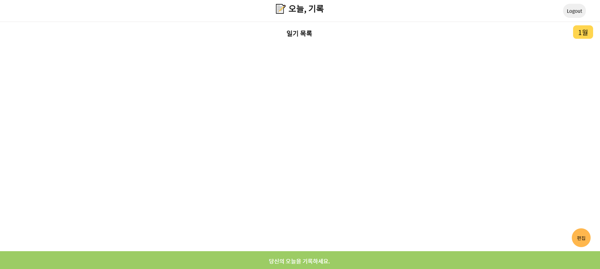

# Diary maker - Girok

 

> 오늘을 기록하는 일기 웹 어플리케이션

### 데모링크 [https://songchangyeop.github.io/Diary--Today-Girok/#/Diary--Today-Girok/](https://songchangyeop.github.io/Diary--Today-Girok/#/Diary--Today-Girok/)

 

 

## Overview

- ### 사용된 언어 및 프레임 워크 : react, css/PostCss/Firebase

## 1. 기능

일기추가
